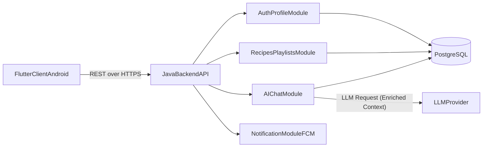
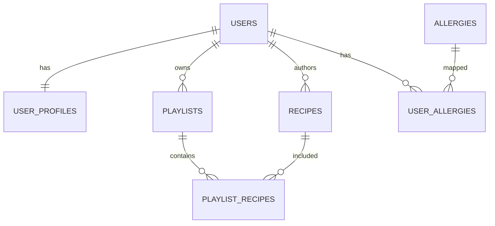
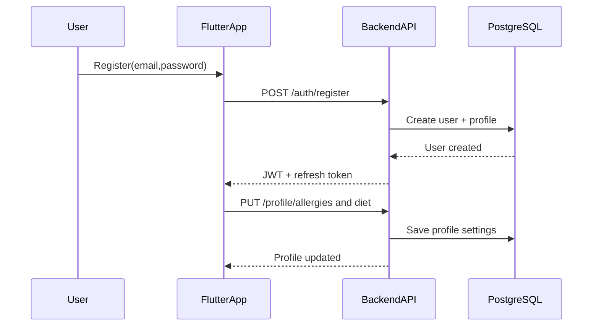
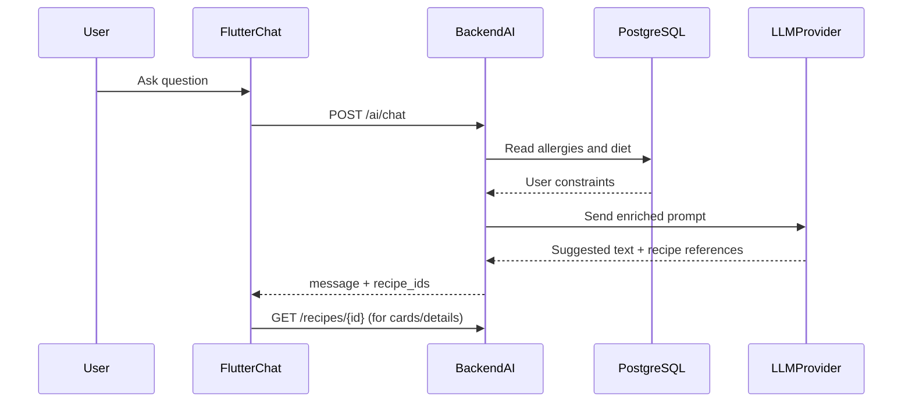

# ARCHITECTURE

## 1. Контекст и цели архитектуры

IWannaEat - Android-приложение рецептов с персонализированным AI-чатом.

Архитектура должна обеспечивать:
- разделение ответственности между Flutter-клиентом и Java backend;
- безопасную аутентификацию и авторизацию;
- масштабируемое хранение рецептов и пользовательских подборок;
- контролируемую интеграцию с LLM через backend;
- стабильную работу в сетевых ошибках (online-only модель).

## 2. Системная архитектура (High-level)

Ключевые принципы:
- Клиент не имеет прямого доступа к LLM.
- Все бизнес-правила централизованы на backend.
- PostgreSQL - единственный источник истины для продуктовых данных.

## 3. Flutter архитектура

## 3.1 Слои и поток данных

Паттерн: Clean Architecture + feature-first.

Поток запроса:
`UI -> BLoC/Cubit -> UseCase -> Repository -> RemoteDataSource(Dio) -> Backend API -> обратно по цепочке`.

Слои:
- `presentation`: экраны, виджеты, BLoC/Cubit, обработка UI-состояний;
- `domain`: entities, repository contracts, use cases;
- `data`: DTO, mappers, repository implementations, API clients.

## 3.2 Основные feature-модули клиента

- `auth`: login/register/refresh/logout.
- `profile`: персональные данные, аллергии, описание диеты.
- `recipes`: лента, поиск, фильтры, CRUD авторских рецептов.
- `playlists`: CRUD подборок и сохранение рецептов.
- `ai_chat`: диалог, отображение карточек рецептов из `recipe_ids`.

## 3.3 UI/UX архитектурные ограничения

- Material 3 + 8dp grid.
- Детальная карточка рецепта через `CustomScrollView` + `SliverAppBar`.
- Все сетевые изображения показывают shimmer skeleton.
- При `No Internet` глобальный full-screen overlay и disable интерактивных действий.

## 4. Java backend архитектура

## 4.1 Логические модули

- `auth`: регистрация, логин, refresh, проверка JWT.
- `user/profile`: профиль, аллергии, роль пользователя.
- `recipes`: рецепты, фильтры, поиск, права доступа.
- `playlists`: подборки и связи с рецептами.
- `ai`: prompt orchestration, вызов LLM, нормализация ответа.
- `admin/moderation`: управление видимостью контента и статусом пользователей.
- `notification`: отправка push через FCM.

## 4.2 Внутренний слой backend

Рекомендуемая схема слоев:
- `Controller` (HTTP API, DTO).
- `Service` (бизнес-логика, транзакции, orchestration).
- `Repository/DAO` (доступ к БД).
- `Infrastructure` (security, integration adapters, external providers).

## 4.3 Контракт API (ключевые endpoints)

- Auth:
  - `POST /auth/register`
  - `POST /auth/login`
  - `POST /auth/refresh`
- Profile:
  - `GET /profile`
  - `PUT /profile`
  - `GET /allergies`
  - `PUT /profile/allergies`
- Recipes:
  - `GET /recipes`
  - `GET /recipes/{id}`
  - `POST /recipes`
  - `PUT /recipes/{id}`
  - `DELETE /recipes/{id}`
- Playlists:
  - `GET /playlists`
  - `POST /playlists`
  - `POST /playlists/{id}/recipes/{recipeId}`
  - `DELETE /playlists/{id}/recipes/{recipeId}`
- AI:
  - `POST /ai/chat` -> `{ message: string, recipe_ids: UUID[] }`

## 5. Архитектура данных (PostgreSQL)

## 5.1 Таблицы и ответственность

- `users`: учетные записи и роли (`user`/`admin`).
- `allergies`: справочник аллергенов.
- `user_profiles`: расширенный профиль (имя, диета).
- `user_allergies`: M2M связь пользователь-аллергия.
- `recipes`: публичные/приватные рецепты, КБЖУ, инструкции, время готовки.
- `playlists`: пользовательские подборки.
- `playlist_recipes`: M2M связь подборка-рецепт.

## 5.2 Связи сущностей

## 5.3 Индексы и ограничения

Минимальные обязательные индексы:
- `users(email)` unique index.
- `recipes(is_public)` index.
- `recipes(cooking_time_min)` index.
- `playlist_recipes(playlist_id, recipe_id)` composite PK/index.

Ограничения целостности:
- FK каскадное удаление для связующих таблиц.
- `role` ограничить whitelist значениями (`user`, `admin`).
- `diet_description` ограничить длиной (до 500 символов на уровне API и/или DB check).

## 5.4 Миграции

- Использовать Flyway/Liquibase.
- Все изменения схемы через версионированные forward-only миграции.
- Rollback стратегия - отдельные corrective migrations.

## 6. Ключевые пользовательские потоки

## 6.1 Регистрация и настройка профиля (US1)

## 6.2 AI чат с персонализацией (US4)

## 7. Нефункциональные аспекты

## 7.1 Безопасность

- Только HTTPS/TLS 1.3.
- JWT в secure storage на клиенте.
- Пароли в БД только в хэшированном виде.
- RBAC для административных операций.
- Ограничение частоты запросов (auth и AI endpoints).

## 7.2 Производительность

- Пагинация по 20 элементов.
- Поисковые запросы опираются на индексы.
- Тяжелый JSON parsing на клиенте в isolates.
- Таймауты/ретраи на внешние LLM вызовы.

## 7.3 Надежность

- Обязательная обработка:
  - No Internet (client-side global state),
  - 401 (logout + redirect),
  - 500-504 (soft failure UI notifications).
- Health checks и базовый мониторинг backend.

## 8. Масштабирование и эволюция

Ближайшие точки роста:
- Выделение AI orchestration в отдельный сервис при росте нагрузки.
- Введение read-replica PostgreSQL для тяжелого чтения.
- Добавление очередей для асинхронных задач (уведомления, модерация, аналитика).
- Внедрение CDN/object storage для медиа рецептов.
